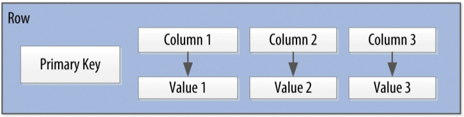
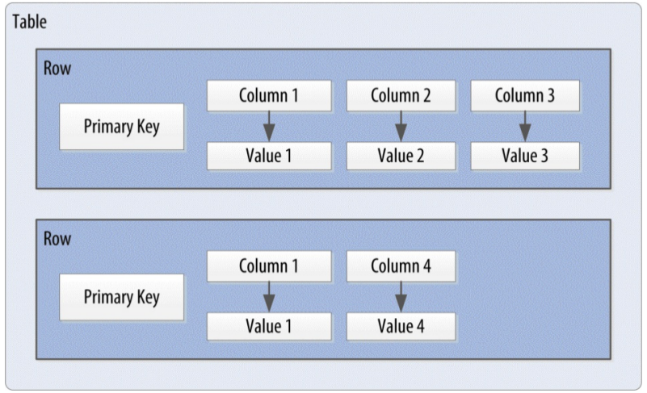
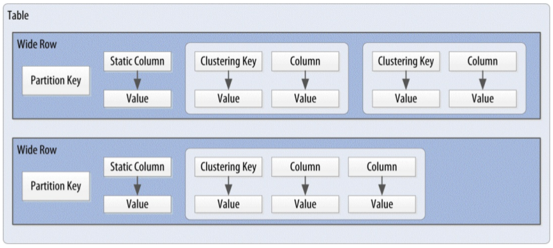

# Cassandra (3.x)

Cassandra基本数据结构：

- *column* 列：`name/value` 键值对
- *row* 行： 包含多个列的容器，并使用主键引用
- *table* 表：行的容器
- *keyspace* 关键空间：表的容器
- *cluster* 集群：由多个 *keyspace* 组成的容器，并存储在一个或多个（物理）节点

**Cassandra 行**

**Cassandra 表**

**Cassandra 宽行**

